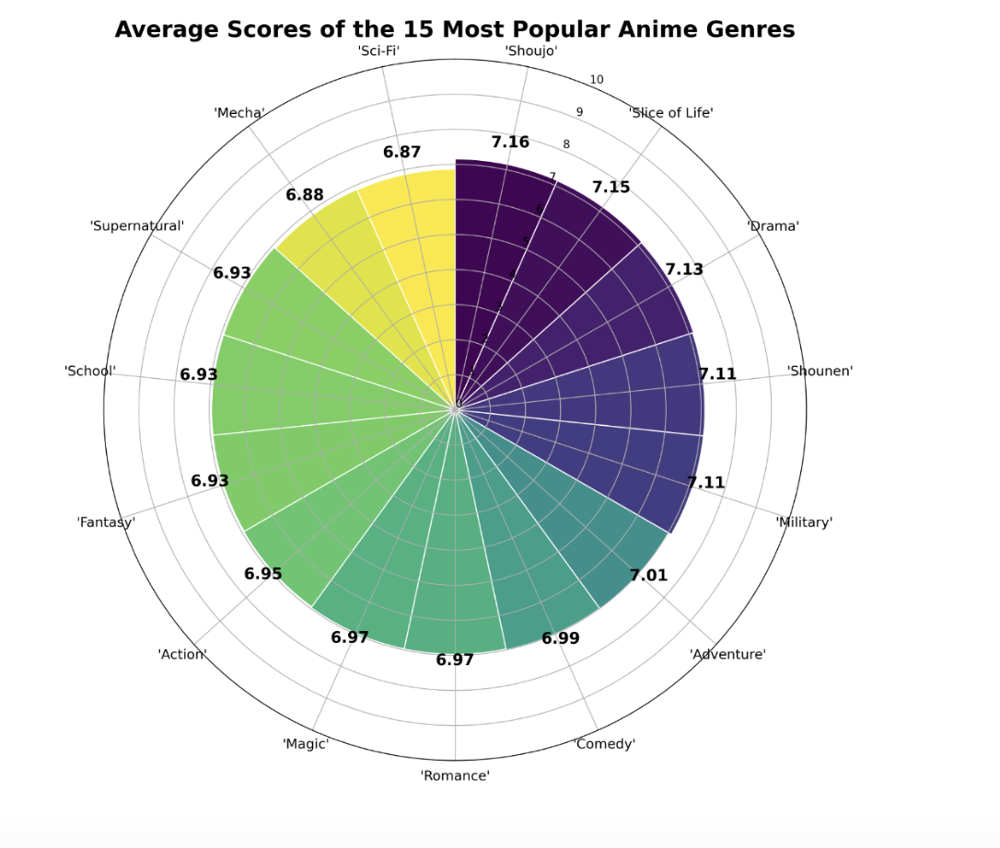

# Final Project Documentation

## Data acquisition (cf. Weeks 3-4) 

### Data Acquisition

The two dataset we got from Kaggle have a csv file available to download. Before downloading the dataset, one has to register an account and accept the use terms on Kaggle. As for the dataset from Jikan API, it is an unofficial REST API for MyAnimeList.net., so we first need to identify the endpoint based on the type of data we look for. According to the term of use in https\://jikan.moe/#, as it is an open source, we are able to adopt the dataset and code to examine and use. This has allowed us to access more comprehensive anime and manga data. We also perform integrity checks as well as checksum to demonstrate transparency in our project. Thus, all of the three dataset, including the one derived from API, has been successfully downloaded and imported into Python and SQL workspace.

### Integrity Checking

We also perform integrity checks to verify that the datasets we used (animes.csv, characters.csv, and myanimelist\_data.csv) have not been modified or corrupted compared to their original versions. 

First of all, we referenced hash values. We maintained a dictionary (stored\_csv) that helped record the expected SHA-256 hash values for each dataset file. These hashes were generated from the original versions of the files and serve as the ground truth for validation. Next, for each of the files, we opened the file in binary mode (rb), read its content, and computed the SHA-256 hash (checksum) with the use of Python’s hashlib library. Then, we compared the current hash of each file with its expected hash. Aftering comparing, we might get two possible results. If the hashes match, it confirms the file is unchanged; if the hashes differ, it means that the file may have been altered or corrupted. Different hashes will lead us to get different analysis results. The comparison results were saved to a file with the path: Results/HashCheck.txt. 

After doing integrity checking, it preserves the reproducibility and credibility of the analysis pipeline.By including transparent integrity checking and checksum, future research for Japanese anime can be more open and trustworthy. 

## Data integration (cf. Weeks 5-6)

Like what we did in the lab, we created CreateDatabase.sql, allowing us to define the data definition language (DDL) for three CSV files and store them in respective tables as well as assigning the appropriate data types to each variable. Then, we created a new table named integrated\_data to consolidate key attributes from these tables. This integrated new table will include a wide range of anime-related information such as ID, title, synopsis, genres, episode count, viewer counts from 2020 and 2025, popularity, and score that are helpful in answering our research questions. 

### Conceptual Model

The conceptual model in this project incorporates three primary data sources, which are an anime dataset containing series metadata, a character dataset with detailed attributes of anime characters, and dataset from an open sourced API key. 

- According to the Entity-Relationship (ER) model, we have treated anime titles and characters as entities. Table 1, table 2, and table 3 are linked through a common identifier of mal\_id and uid. 

* The CreateDatabase.sql establishes appropriate data definition language (DDL) statements for each entity type based on designed primary and foreign key relationships. 

### Integration Schema 

Our integration is achieved through SQL operations. We merged the data based on a common key, mal\_id. 

- The ImportData.sql addresses common challenges in cross source integration including header row exclusion, data type consistency, and character encoding standardization in the data importation process. 

### Integration Query

- The IntegrateData.sql represents the key attributes, where we construct a unified integrated\_data table (table 4) through sophisticated join operations, attribute selection, and data transformation logic. Rather than simple concatenation of source tables, our approach employs inner and left outer joins strategically based on entity relationships.

* The ExportData.sql exports the database to a csv file and saves it in the sub folder called data.

## Profiling, Quality Assessment, Cleaning (cf. Week 7)

First, we loaded the datasets with the use of pandas and displayed the first five rows with the .head(5) method. We also examined the basic dimensions of each dataset such as the number of rows and columns. Then, we conducted descriptive analysis to understand the distributions and ranges of numerical variables by applying .describe(). We used df.dtypes to verify that the data types aligned with the expected formats. Next, we checked for duplicates using the .duplicated() method and handled missing values by either replacing them with appropriate values such as the average or leaving them as NaN where necessary. After dealing with missing values, we visualized the results of duplicates and missing values. These graphs helped provide us a clearer understanding of how to manage data inconsistencies and gaps. Finally, we performed an initial exploratory analysis to uncover key patterns. This helped guide the direction for deeper and more targeted data analysis in the later stages of the project.

## Data Analysis And Visualization

In order to answer the research questions that we are exploring earlier, we have constructed several data visualizations to help us better understand the relationship between different attributes in the dataset and their contribution to anime popularity.

### Relationship between Anime Scores and Viewership

This scatterplot indicates the relationship between anime scores and number of viewers; it shows a moderate positive relationship between an anime’s score and its viewership. The scatterplot reveals a wide spread at the end as many anime with scores in the range between 7 to 9 have higher viewership. For instance, the most watched titles usually have solid scores around 7 or higher. There are also few instances showing highly popular with very low scores, which shows that extremely bad anime rarely becomes massively popular. 

#### Anime Score With Highest Number of Viewers (Q1.1)

A very high score does not always mean that an anime is widely watched. As shown in the bottom right clusters of dark points where they have a score range between 8 to 9 with under 500k or 100k viewers, we see numerous points with scores higher than 8 that have only average viewership.While a good score can help an anime gain popularity, other factors clearly influence popularity since a higher score only weakly correlates with more viewers.

#### High Score Anime With Average Viewership (Q1.2)

Some anime are highly rated by the viewers who watch them but they are not very popular overall. From our analysis, we can identify animes with exceptional scores with relatively low viewer counts. One example is Ashita no Joe 2, a boxing drama with an average score around 8.74 with only about 60,000 viewers. Another example is the legendary space opera Legend of the Galactic Heroes, which has an outstanding 9.01 score with roughly 342,000 members. There are some special cases like the film Shoujo Kageki Revue Starlight Movie which scores 8.5 with under 25k viewers. These examples demonstrate there are high quality animes that remain watched by a relatively limited audience., and Kingdom’s later seasons (e.g. Season 5 with score \~8.7) have under 50k members despite critical praise. Such titles illustrate the gap – high Score but low Members – indicating strong approval from a few, not the masses.

#### Why Do High Quality Series Remain Less Popular (Q1.3)

There are several reasons why a high quality series might remain less known compared to other ones. Age and availability play a big role because many high quality series are older anime that aired before the anime boom or never got released internationally. For instance, Ashita no Joe 2 is over 40 years old already. Despite its classic status among veterans, newer generations have limited exposure to it. Older shows often suffer from outdated animation style or simply aren’t marketed on modern streaming platforms, which leads them to underperform in terms of attracting viewers. In other cases, minimal marketing or distribution issues can keep quality series obscure. As a result, having a high score is not enough to guarantee popularity. Without accessibility, broad appeal, or marketing, even top tier anime can remain relatively less known.

#### Common Characteristics Of Less Known High Quality Series (Q1.4 & Q1.5)

Based on observing some less known high quality series, we can spot some common characteristics among them. A lot of them tend to be older or classic series that never got the viral attention recent hits enjoy. Many were released in decades when the international anime fanbase was smaller or they belong to long running series that only dedicated fans follow into later seasons. These animes often come from specific genres since our analysis indicates that certain genres are often highly rated but not very popular​ like award winning, sports, or avant garde. For example, sports anime or certain titles frequently usually attract a smaller fan base compared to mainstream genres like shounen or action. A lot of the high score anime titles also require prior knowledge about their complex storylines. Thus, these animes often share traits like older release years, specific genres, and limited exposure which explains why their quality isn’t reflected in massive viewership.

#### Popular Anime With Average Scores (Q1.6 & Q1.7)

Conversely, there are anime that attract huge viewership despite having relatively lower scores. These are often the trending series that everyone watches even if many consider them average in quality. A prime example is Sword Art Online where it has over 3.1 million members with an average score around 7.2. This average score shows that a lot of fans watch it for its popular premise despite mixed critical reception. In fact, Sword Art Online II attracts about 2 million viewers with a lower score of 6.7. We notice that a lot of trending animes  spark huge discussion and trend on social media despite being considered just okay by critical viewers. This phenomenon often appears once an anime becomes overly popular; it will face a critical backlash that decreases its average score. Nonetheless, the outstanding popularity demonstrates that these shows succeed in grabbing attention even if their scores are not the highest.

### How Active Do Viewers Engage Based On Anime’s Popularity

The graphs indicate a complex relationship between an anime’s popularity and how actively its viewers engage as measured by engagement activities. Viewers are most actively engaged through rating and favoriting when an anime resonates strongly with them, which is often correlated with the anime’s quality and its popularity. While popular anime gather a large number of engaged users, their engagement proportion may be affected by different viewers. On the other hand, anime with slightly smaller but passionate audiences can see disproportionately high engagement rates. As shown in the graphs, high score anime usually achieve high engagement ratios compared to average anime. Conversely, low score anime also achieve high engagement ratios due to fans complaining compared to average. In other words, anime popularity alone does not guarantee active discussion or feedback. Instead, the quality of an anime affects whether viewers engage very actively or not. 

#### Rating Participation And Audience Satisfaction (Q2.1)

A higher score percentage generally signals a more engaged audience. When a large fraction of viewers takes the time to score an anime, it suggests that the show left a strong impression that compels viewers to voice their opinion whether it is positive or negative. For instance, an anime where 80% of its viewers rated it likely inspired its audience to actively participate, reflecting engagement through both satisfaction and a sense of investment in the show’s quality. By contrast, if an anime’s scored percentage is low, it might indicate that many viewers felt indifferent or unmotivated to provide feedback due to the fact that the show failed to stand out. Thus, a high scored percentage often correlates with an engaged viewership that cared enough about the anime to record their opinion because they found the experience unforgettable.

#### Popular Animes With High Viewships (Q2.2)

Animes with a large share of viewers does not always have the highest overall popularity. The graphs suggest that some animes with very high rating participation are not the ones with the biggest audiences. For example, an anime might have a relatively average member count with extremely high score percentage; it indicates that almost everyone who watched felt strongly enough to rate it. Another immensely popular title might have millions of viewers with an average score percentage due to the fact that many casual viewers did not engage beyond watching. High popularity sometimes affects the percentage of engaged feedback because the audience includes a broad mix of dedicated fans and passive viewers. Conversely, anime that appeal to a specific passionate community may achieve a high proportion of engagement without being mainstream hits. Thus, anime that inspire a large fraction of their viewers to rate them are often those that foster strong engagement, which can occur at any popularity level. High popularity and high engagement can happen at the same time but a large audience alone does not always guarantee that most viewers will participate in rating.

#### Score Percentage Trends With Anime Score (Q2.3)

Based on the graph, there is a clear upward trend in the score percentage as the anime’s average score increases.The lower rated anime with average scores around the 4 to 6 tend to have relatively low fractions of their audience rating them. As the average score gets higher, the score percentage correspondingly grows where the slope rises significantly for high score titles. For example, at an average score near 7.0, one might observe roughly around 50% of the members have scored the anime. Moving up to an average score around 8.5, the scored participation could increase to about 70% or more. By the time we reach the top tier anime with scores in the range of 8 or 9, we can see that the vast majority of viewers gave a rating. This positive correlation suggests that higher overall quality motivates more viewers to engage. As a result, viewers are more inclined to record their personal score because they either enjoyed it or felt strongly disagreed with it, which indicates that engagement proportion is depending on the anime quality.

#### Favorite Percentage And Anime Score (Q2.4)

The favoriting behavior of viewers also intensifies as anime score increases because the graph shows that anime with low average scores have minimal portions of their audience marking them as favorites. There is only a fraction of a percent up to around 1 to 2% of viewers for mediocre shows. As we look at more highly rated anime, the favorite percentage rises steadily with the anime’s score. For instance, an anime rated around 8.0 might have roughly 3 to 5% of its viewers listing it as a favorite. When we reach elite anime with average scores near 9.0, the favorite rate can achieve around 6%. This means that one in ten viewers of a top rated anime loved it so much that they added it to their personal favorites list. This trend indicates that the better an anime is rated on average since it is more likely to inspire fans to consider it one of their favorites. The upward trend in the graph underscores that higher quality anime create stronger personal attachments.

#### Favorite Proportion With High Anime Score (Q2.5 & Q2.6)

Based on our observation, there appears to be a strong positive correlation between an anime’s average user score and the fraction of its viewers who mark it as a favorite. High score anime tend to cluster at the upper end of the favorited percentage scale. In the graph, the shows with the highest average scores also generally exhibit among the highest favorite proportion. For example, a high score series with a score around 8 or 9 may show a favorited percentage above 10%, whereas shows with average scores in the 6 to 7 rarely see more than 1 to 2% of viewers favoring them. This finding suggests that anime which achieve high average scores are often the same ones that many viewers hold dear enough to call their favorites. However, some anime might have a high score but a slightly lower favorite rate. Conversely, a show could have an average score with devoted fans who all favorite it even though these cases are less common. Overall, the trend from the graph supports that high average score anime also tend to have a higher fraction of their audience marking them as favorites, which demonstrates that quality often leads to higher fan appreciation and engagement.

### The Most Popular Genres Based On Scores And Views

By analyzing the radar chart, it becomes evident that certain genres have a distinctly stronger association with high viewership and widespread popularity. The radar chart distinctly illustrates that shoujo, slice of life, and drama are the three most popular genres associated with their viewer ratings as indicated by their notably higher scores. These visual indications suggest that anime within these genres consistently receive high scores among viewers. The genre shoujo shows the highest average score on the chart . Such consistent high ratings imply that the shoujo genre successfully captures audience attention through compelling character development and emotionally engaging narratives. Beyond identifying top-performing genres, the radar chart provides detailed information about each genre and their appearance frequency.

The success of shoujo, slice of life, and drama suggests that anime creators and streaming platforms might strategically prioritize these genres on account of their viewership and positive audience engagement. As they consistently receive high scores, these genres illustrate a degree of predictability in viewer satisfaction, making them safer choices for future investments and marketing efforts. Moreover, the presence of these genres implies potential shifts or trends in viewer preference, indicating an audience inclination towards narrative complexity and emotional depth. Hence, future anime productions aiming for broader viewership might benefit from integrating elements from these successful genres to optimize viewer reception and popularity. As a result, the radar chart effectively highlights the popularity of each genre and provides valuable insights about anime fans’ preferences. The consistently strong performance of these genres emphasizes their potential in anime market strategy, guiding streaming services and producers.

#### Genres With Successful Shows (Q3.1) 

The radar chart distinctly identifies genres such as shoujo, slice of life, and drama as top tier genres performing well historically. Shoujo anime's high scores indicate its substantial viewership, driven by emotionally resonant storytelling and character depth. Similarly, drama and slice of life maintain consistently high ratings by delivering emotionally engaging stories. The success of these genres has meaningful implications for streaming services and content producers. Platforms prioritizing these genres can attract viewers and reduce investment risks. Additionally, investing in these genres fosters long term fan bases. For anime fans, the consistent success of these genres provides significant reassurance. Fans who prefer these genres can confidently explore new titles, expecting them to meet high standards of storytelling and character development.

#### Impact Of Popular Genres On Audience Numbers (Q3.2) 

While the radar chart does not explicitly list harem or ecchi, it provides insights by evaluating associated genres. The shounen genre, which is typically related to action, exhibits high average scores. This suggests audiences widely appreciate shounen style anime due to its dynamic storytelling and adventurous themes. The absence of ecchi in the chart suggests relatively lower significance or lower scores, which shows lower average viewer ratings compared to shounen or action genres. These differences provide valuable information for both streaming platforms and anime fans.

Streaming platforms seeking broad market appeal and substantial audience growth may find greater success focusing on shounen style action anime. Prioritizing action related stories can engage wider, more diverse audiences. Conversely, platforms should be cautious about investing heavily in genres with potentially narrower appeal, such as ecchi or harem, due to limited overall subscriber growth. For fans, this graph clarifies expectations regarding genre based content quality and popularity, guiding their exploration and preferences.

#### Genres Correlated With Lower Anime Performance (Q3.3) 

The radar chart highlights certain genres correlated with lower average performance such as science fiction and mecha. Sci fiction anime face challenges possibly due to complex themes that might not resonate broadly as indicated by the lowest average score. Likewise, the mecha genre has relatively lower scores, which illustrates diminished contemporary relevance or reduced viewer interest. Content producers and platforms could strategically approach these genres by targeting specific niche viewers rather than broader market segments. Furthermore, producers should carefully evaluate content quality, innovation, and audience appeal before investing in these genres.

Understanding these genre limitations enables platforms to better design content strategies with realistic viewer expectations so that they can optimize resource allocation, mitigate risks, and enhance overall streaming success. This genre performance helps anime fans to set realistic expectations regarding specific types of content. Fans interested in lower performing genres such as horror or sports might anticipate variable quality or limited mainstream representation. In addition, recognizing these challenges allows studios and platforms to prioritize improving content quality or experimenting with genre innovations that enhance overall viewer experience.

#### Genres With High Scores (Q3.4) 

Certain genres such as slice of life achieve high viewer ratings despite their average popularity levels. The outstanding performance of slice of life anime emphasizes viewers enjoy its emotionally resonant scenarios. The dedicated fanbase of these genres demonstrates that viewer satisfaction does not only depend on its viewership; the high scores also reveal deep emotional connections between the content and its audience. Streaming services should use these information to develop more targeted content strategies that focus on specific genres with small dedicated fan communities. Platforms could strategically develop dedicated sections or recommendation systems to highlight high quality genres. Furthermore, the targeted promotion and effective curation of these genres could significantly increase viewers retention rates, foster better viewer engagement, and improve overall viewer experience. For anime fans, viewers who are interested in slice of life and other similar genres benefit significantly from specialized recommendations and platform discovery, which fosters better communities around these genres.

#### The Success Of Niche Genres (Q3.5)

The radar chart further indicates that specialized niche genres like slice of life or mystery incorporated psychological thriller elements, which leads to their consistent success and strong positive reception among their fans despite their average overall popularity. Streaming platforms can attract dedicated fans through targeted marketing, specialized promotion, and personalized recommendations.

The growing recognition and prioritization of these genres by streaming platforms yield substantial benefits for dedicated fan communities. As platforms increasingly cater to audiences of underrepresented genres, these audiences gain access to better content libraries featuring rare, culturally specific titles. Empirical studies suggest that such personalized engagement correlates with heightened emotional investment  as fans perceive their tastes as institutionally acknowledged. Thus, this symbiotic relationship between platforms and fans diversifies the anime market and fosters a culture of inclusivity.

## Automated Workflow (cf. Week 10) 

Our project’s workflow automates the retrieval, cleaning, integration, and export of anime-related datasets. We primarily applied Python scripts, SQL scripts, and Snakemake to manage dependencies and ensure correct execution order. 

### Data Acquisition

First, we set up API keys. Through DataAcquisition/GetKey.py, it retrieved the necessary keys, and it produced two output files: Key/Googlekey.txt and Key/ApiKey.txt. Secondly, we downloaded the anime dataset and character dataset from Kaggle. This was accomplished by the script DataAcquisition/DownLoadData.py, which uses the generated API keys to fetch data and save it as Data/animes.csv and Data/characters.csv. In addition, using the Jikan API, additional data is fetched through the script DataAcquisition/Jikan.py. This script reads the previously downloaded anime and character files, which lead us to have a more comprehensive dataset (Data/myanimelist\_data.csv) for later integration.

### Data Preprocessing

Next, we cleaned each dataset. The anime table is cleaned using DataCleaning/Table1Clean.py, the character table is processed with DataCleaning/Table2Clean.py, and the MyAnimeList data is cleaned by DataCleaning/Table3Clean.py. Each cleaning script takes a raw CSV file as input and produces cleaned versions: Data/animes\_clean.csv, Data/characters\_clean.csv, and Data/myanimelist\_data\_clean.csv. 

### Data Integration

After we completed data cleaning, the workflow moved to database creation. First of all, DataIntegration/CreateDatabase.sql creates the database schema, and DataIntegration/ImportData.sql adds the database with the cleaned datasets. During this process, we applied SQLite3 command-line tools. In the end, we got a database file named Database/IntegratedJapaneseAnime.db.

### Automation 

After we had the created database, we started the integration. By running DataIntegration/IntegrateData.sql, it processed and merged all the datasets inside the database. Then, we exported the final integrated dataset to Data/integrated\_anime\_data.csv through DataIntegration/ExportData.sql. After running snakemake with –cores 1, snakemake will automatically run all the required steps in the workflow, including the plots and visualizations. These output images are then saved to the project directory, including correlation matrices, viewer engagement trends by genre, and score distributions across different genres, providing insight into patterns within the dataset. All of the graphs can be reproduced as part of the pipeline and does not require any manual intervention. As an additional verification step, we included a SHA-256 checksum for the final exported file to ensure its integrity. This allows other users to detect accidental changes and ensure they get the same output. Finally, in order to run the entire workflow and complete the above processes, users simply run the command snakemake --cores 1 inside the project directory.

## Reproducible package (cf. Week 8) 

To ensure that someone else can fully reproduce the results of the Anime Database Project, we will break down the reproduction process into retrieving API keys, downloading and enriching anime and character datasets, cleaning raw data, integrating the datasets into a SQLite database, and exporting the final integrated file. 

### Reproducible Workflow: From Raw Data to Unified Dataset

As we have adopted an automated process and snakemake, the users will be able to reproduce the results by simply typing snakemake --cores 1 in their terminal command line. That is, users do not need to manually deal with the process of data acquisition, data cleaning, data integration, and data exportation. For example, they will not have to download the dataset through Kaggle and retrieve additional anime data through the Jikan API key. They won’t have to apply .head() to inspect the data or .isna() to detect missing values. In data integration, they will not have to join the tables by themselves. All the relevant fields from the anime, character, etc, will be automatically joined. In the end, users will get an unified dataset. 

If we don’t have the automated workflow, users will have to download the dataset through Kaggle and retrieve additional anime data through the Jikan API key. As for data cleaning and data integration, they will use basic python built-in functions such as .head() to inspect the data or .isna() to detect missing values in a jupyter notebook. In data integration, users will have to create a SQLite database using structured SQL scripts to define tables and import the cleaned datasets manually. Then, they have to use SQL join operation to combine relevant fields from the anime, character, and API datasets to produce a unified dataset. 

Our data is located at the following link. Since we have made everything into the automation workflow, you do not have to manually download it. You are also welcome to use it as reference to check the original dataset through this link.

<https://drive.google.com/drive/folders/1L6M2u4pqygafodC8ZZYlJ_FyMmuv04qQ?dmr=1&ec=wgc-drive-hero-goto>

### Software Environment and Dependency Specification

To ensure the reproducibility of our project, we have included a detailed specification of all software dependencies required to run the code in requirements.txt file. For future users, they should have Python 3.1.2 installed (Python packages: requests, pandas, and matplotlib), Snakemake (in your local terminal:pip install snakemake), and SQLite3. Important dependencies they need will be pandas==2.2.3, numpy==2.2.3, scikit-learn==1.6.1, matplotlib==3.10.1, seaborn==0.13.2, and snakemake==9.1.2. These environment and library versions ensure future users can recreate the same software setup, minimizing version conflicts and supporting the reproducibility of our analysis and results.

### Licensing Information for Data and Software

The data license for this project will be licensed ****under the Creative Commons Attribution 4.0 International (CC BY 4.0). We selected the CC BY 4.0 license because this is an internationally accepted license, which avoids confusion about regional legal differences. As our original datasets are from Kaggle and the Jikan API, proper attribution is needed to maintain transparency about how the datasets were generated and processed. The software license for this project will be licensed under the MIT License. This enables others to freely use, modify, distribute, and build upon the code. We chose this license as we hope people who are passionate in expanding this dataset can also collaborate and share their information. The cleaned and integrated one will also be released under the Creative Commons Attribution 4.0 International (CC BY 4.0) license. Under this license, users are free to share and adapt the data for any purpose, but attribution is required. Future users must offer proper credit, link to the license, and indicate if changes were made.By applying these open licenses to both our software and data, this supports reproducible research practices, encourages ethical data sharing, and facilitates further exploration and innovation based on our work.

## Citation Of Data And Software Used (cf. Week 12)

Kaggle is not our primary data source, but Kaggle is the platform where the information and dataset is shared. The dataset is crawled from [MyAnimeList.net](https://www.kaggle.com/datasets/marlesson/MyAnimeList.net). Therefore, we cited both Kaggle and [MyAnimeList.net](https://www.kaggle.com/datasets/marlesson/MyAnimeList.net) in our citation below. 

### Dataset Citation

Marlesson. (2025-03-15). Anime Dataset with Reviews - MyAnimeList | Kaggle. Retrieved from 

<https://www.kaggle.com/datasets/marlesson/myanimelist-dataset-animes-profiles-reviews?select=reviews.csv>

Andreu Vall Hernàndez. (2025-03-15). MyAnimelist Jikan Database | Kaggle. Retrieved from <https://www.kaggle.com/datasets/andreuvallhernndez/myanimelist-jikan?select=characters.csv>

MyAnimeList. (2025-03-15). _MyAnimeList_. Retrieved March 15, 2025, from[ https://myanimelist.net/](https://myanimelist.net/)

### API Citation

@irfanDahir. (2025-05-05). Jikan - Unofficial Myanimelist API. Retrieved from <https://jikan.moe/>

### Software Citation

Python Software Foundation. (2023). Python (Version 3.11) \[Computer software]. Available from <https://www.python.org/>

Hipp, D. R. (2023). SQLite \[Software]. <https://www.sqlite.org/>

\

## Metadata Describing Our Dataset And Package (cf. Week 13)

\

### Anime table 

|                   |            |                                                                                                                                                                                                                                                                                                                                                                 |
| ----------------- | :--------: | :-------------------------------------------------------------------------------------------------------------------------------------------------------------------------------------------------------------------------------------------------------------------------------------------------------------------------------------------------------------: |
| **Field Name**    |  **Type**  |                                                                                                                                                                         **Description**                                                                                                                                                                         |
| **Anime ID**      |    Integer |                                                                                It is the unique identifier assigned to each anime entry. It also serves as the primary key in this table. This ID is consistent with the anime\_api table’s anime\_id, allowing cross-reference.                                                                                |
| **English Title** |     String | The title of the anime in English, or romaji if the English title is unavailable. It is used to label and reference anime in analysis or user interfaces. English titles are used for international or Western distribution. This column is especially important for non-Japanese audiences as it provides a more accessible reference to the anime's identity. |
| **Synopsis**      |    String  |                                                                                            A brief narrative description of the anime’s story or premise. The description is often extracted from the official source and gives users an overview of what to expect.                                                                                            |
| **Genre**         |    String  |                                                          A comma-separated list of genres assigned to the anime, such as 'Action', 'Comedy', 'Fantasy', or 'Slice of Life'. This column helps in thematic analysis, filtering, and genre-based recommendations. Most anime belong to multiple genres.                                                           |
| **Broadcast**     |    String  |                                The date or date range when the anime was originally aired in Japan.  This is useful for identifying the seasonal or historical context of the anime, such as whether it aired in Spring 2020 or during the 1990s. Some entries may show specific dates, while others might only include the year.                               |
| **Episodes**      |   Integer  |                                                         The total number of episodes the anime contains. This includes all main story episodes, but not necessarily specials or OVAs unless integrated in the source. Missing values were filled using the mean number of episodes during preprocessing.                                                        |
| **Viewers**       |   String   |                                                                              The total number of MyAnimeList users who have marked this anime as 'watched', 'watching', 'plan to watch. "This metric indicates the level of attention or interest from the global anime community.                                                                              |
| **Popularity**    |   Integer  |                                                                                     This differs from “Rank.”' Popularity is based on average ratings. The popularity score of the anime on MyAnimeList, based on its number of followers, favorites, and watchlist status.                                                                                     |
| **Rank**          |   Integer  |                                           The relative position of the anime based on user-generated ratings on MyAnimeList. A lower rank value means a higher-rated anime, while higher numbers indicate lower average ratings. This column helps in quickly identifying critically acclaimed or fan-favorite titles.                                          |
| **Score**         |   Integer  |                                                                                                     The average user rating on a scale from 0 to 10, typically with one decimal place. Missing values were imputed with the mean score during data cleaning.                                                                                                    |
| **Image URL**     |   String   |                                                                        A direct URL link to the anime's official image or promotional poster hosted on MyAnimeList. These images are typically used in visual dashboards, web displays, or for recommendation systems to show cover art.                                                                        |
| **Link**          |   String   |                                         The original MyAnimeList URL that links to the anime’s detailed page. In this dataset, the links were hashed using SHA-256 for privacy and data consistency. These hashed values are useful for anonymized tracking or linking to external metadata without revealing raw URLs.                                         |

### Character table

|                                 |          |                                                                                                                                                                                                                                                                |
| ------------------------------- | -------- | :------------------------------------------------------------------------------------------------------------------------------------------------------------------------------------------------------------------------------------------------------------: |
| **Field Name**                  | **Type** |                                                                                                                         **Description**                                                                                                                        |
| **Anime ID**                    | Integer  |                                                   The character is associated with this unique identifier. This ID allows for linking characters back to their corresponding anime entries in other datasets.                                                  |
| **Character English Name**      | String   |                                                             The character's name is in English or Romanized format, which is typically how the character is referred to in Western fan communities.                                                            |
| **Character Japanese Name**     | String   |                                     This column is the character's full name written in Kanji (Japanese characters). This preserves original naming conventions and is useful for cross-referencing with Japanese sources.                                     |
| **Character NickName**          | String   |                                    A list of commonly used nicknames or aliases for the character. These can reflect how fans or other characters refer to them informally. The nicknames are compiled by MyAnimeList users.                                   |
| **Character Favorites**         | Integer  |                                                       The number of users who have marked this character as a favorite on MyAnimeList. This shows popularity and emotional engagement with the character.                                                      |
| **Information About Character** | String   | A textual biography or profile of the character, including backstory, personality traits, notable events, and relationships. This information can be useful for sentiment analysis, topic modeling, or identifying recurring archetypes in anime storytelling. |
| **Character Link**              | String   |                                                                           The link is derived from MyAnimeList for the character’s profile page. This column is hashed for privacy.                                                                            |

###  Api table

|                        |          |                                                                                                                                                                                                    |
| ---------------------- | -------- | :------------------------------------------------------------------------------------------------------------------------------------------------------------------------------------------------: |
| **Field Name**         | **Type** |                                                                                           **Description**                                                                                          |
| **Anime ID**           | Integer  |                             A unique identifier that matches the anime entry from Table1. This ID allows cross-referencing between the anime table and character table.                            |
| **Anime Type**         | String   |                          The format or production type of the anime, such as TV, Movie, or OVA.This helps classify anime by their typical length and distribution format.                          |
| **Anime Source**       | String   |  The original source material for the anime, such as Manga, Light novel, Visual novel, or Original. This indicates whether the anime was adapted from existing media or was an original creation.  |
| **Airing Status**      | String   |                      A boolean indicator of whether the anime is still airing.Typically, False means the series has completed, while True would mean it is currently ongoing.                      |
| **Anime Mppa Rating**  | String   |                          The age rating assigned to the anime such as PG, PG-13, R - 17+. This is useful for content filtering or age-appropriate recommendation systems.                          |
| **Viewers**            | Integer  | The total number of MyAnimeList users who have interacted with the anime (watched, planned to watch, etc.). This metric indicates the overall reach or exposure of the anime within the community. |
| **Viewers Who Scored** | Integer  |                              The number of users who provided a numerical score. This is useful for understanding active engagement rather than just passive interest.                             |
| **Favorites**          | Integer  |                   The number of users who marked this anime as a personal favorite. This represents strong fan attachment and can help identify cult classics or beloved titles.                   |
| **Anime Studio**       | String   |        The name of the primary animation studio responsible for producing the anime. Studios like Madhouse, Bones, or Toei Animation are often analyzed for style, quality, or fan loyalty.        |
| **Favorite Rate (%)**  | Float    |          The percentage of total viewers who added the anime to their favorites list. Calculated as (Favorites / Viewers) × 100. This rate measures how intensely viewers loved the anime.         |
| **Score Rate (%)**     | Float    |  The percentage of viewers who rated the anime after watching it, which is calculated as (Viewers Who Scored / Viewers) × 100. This indicates how engaged the audience was in providing feedback.  |

### Integrated table

|                                     |          |                                                                                                                                                                                                                                                                                                                                                                 |
| ----------------------------------- | -------- | :-------------------------------------------------------------------------------------------------------------------------------------------------------------------------------------------------------------------------------------------------------------------------------------------------------------------------------------------------------------: |
| **Field Name**                      | **Type** |                                                                                                                                                                         **Description**                                                                                                                                                                         |
| **Anime ID**                        | Integer  |                                                                                                                 A unique integer identifier for each anime entry, serving as the primary key for joining anime, character, and statistical data.                                                                                                                |
| **Anime Type**                      | String   |                                                                                                         The format or production type of the anime, such as TV, Movie, or OVA.This helps classify anime by their typical length and distribution format.                                                                                                        |
| **Anime Source**                    | String   |                                                                                 The original source material for the anime, such as Manga, Light novel, Visual novel, or Original. This indicates whether the anime was adapted from existing media or was an original creation.                                                                                |
| **Airing Status**                   | String   |                                                                                                     A boolean indicator of whether the anime is still airing.Typically, False means the series has completed, while True would mean it is currently ongoing.                                                                                                    |
| **Anime Mppa Rating**               | String   |                                                                                                         The age rating assigned to the anime such as PG, PG-13, R - 17+. This is useful for content filtering or age-appropriate recommendation systems.                                                                                                        |
| **Viewers**                         | Integer  |                                                                                The total number of MyAnimeList users who have interacted with the anime (watched, planned to watch, etc.). This metric indicates the overall reach or exposure of the anime within the community.                                                                               |
| **Viewers Who Scored**              | Integer  |                                                                                                            The number of users who provided a numerical score. This is useful for understanding active engagement rather than just passive interest.                                                                                                            |
| **Favorites**                       | Integer  |                                                                                                  The number of users who marked this anime as a personal favorite. This represents strong fan attachment and can help identify cult classics or beloved titles.                                                                                                 |
| **Favorite Rate (%)**               | Float    |                                                                                        The percentage of total viewers who added the anime to their favorites list. Calculated as (Favorites / Viewers) × 100. This rate measures how intensely viewers loved the anime.                                                                                        |
| **Score Rate (%)**                  | Float    |                                                                                 The percentage of viewers who rated the anime after watching it, which is calculated as (Viewers Who Scored / Viewers) × 100. This indicates how engaged the audience was in providing feedback.                                                                                |
| **English Title**                   | String   | The title of the anime in English, or romaji if the English title is unavailable. It is used to label and reference anime in analysis or user interfaces. English titles are used for international or Western distribution. This column is especially important for non-Japanese audiences as it provides a more accessible reference to the anime's identity. |
| **Synopsis**                        | String   |                                                                                            A brief narrative description of the anime’s story or premise. The description is often extracted from the official source and gives users an overview of what to expect.                                                                                            |
| **Genre**                           | String   |                                                              A comma-separated list of genres assigned to the anime, such as Action, Comedy, Fantasy, or Slice of Life. This column helps in thematic analysis, filtering, and genre-based recommendations. Most anime belong to multiple genres.                                                               |
| **Broadcast**                       | Boolean  |                                The date or date range when the anime was originally aired in Japan.  This is useful for identifying the seasonal or historical context of the anime, such as whether it aired in Spring 2020 or during the 1990s. Some entries may show specific dates, while others might only include the year.                               |
| **Episodes**                        | Integer  |                                                         The total number of episodes the anime contains. This includes all main story episodes, but not necessarily specials or OVAs unless integrated in the source. Missing values were filled using the mean number of episodes during preprocessing.                                                        |
| **Popularity**                      | Integer  |                                                                                     This differs from “Rank.”' Popularity is based on average ratings. The popularity score of the anime on MyAnimeList, based on its number of followers, favorites, and watchlist status.                                                                                     |
| **Rank**                            | Integer  |                                           The relative position of the anime based on user-generated ratings on MyAnimeList. A lower rank value means a higher-rated anime, while higher numbers indicate lower average ratings. This column helps in quickly identifying critically acclaimed or fan-favorite titles.                                          |
| **Score**                           | Integer  |                                                                                                     The average user rating on a scale from 0 to 10, typically with one decimal place. Missing values were imputed with the mean score during data cleaning.                                                                                                    |
| **Anime Link**                      | String   |                                                                                                              The original MyAnimeList URL points to the anime’s official profile page. This may be hashed or preserved depending on privacy needs.                                                                                                              |
| **Character English Name**          | String   |                                                                                                             The character's name is in English or Romanized format, which is typically how the character is referred to in Western fan communities.                                                                                                             |
| **Character Japanese Name**         | String   |                                                                                      This column is the character's full name written in Kanji (Japanese characters). This preserves original naming conventions and is useful for cross-referencing with Japanese sources.                                                                                     |
| **Character Nickname**              | String   |                                                                                    A list of commonly used nicknames or aliases for the character. These can reflect how fans or other characters refer to them informally. The nicknames are compiled by MyAnimeList users.                                                                                    |
| **Character Favorites**             | Integer  |                                                                                                       The number of users who have marked this character as a favorite on MyAnimeList. This shows popularity and emotional engagement with the character.                                                                                                       |
| **Information About Chara****cter** | String   |                                                  A textual biography or profile of the character, including backstory, personality traits, notable events, and relationships. This information can be useful for sentiment analysis, topic modeling, or identifying recurring archetypes in anime storytelling.                                                 |
| **Url**                             | String   |                                                                                                           The original or hashed link to the character’s profile page on MyAnimeList. It can be used for referencing or scraping additional metadata.                                                                                                           |

## Archival Record (cf. Week 14)

## Persistent Identifier (cf. Week 12 or 14)

